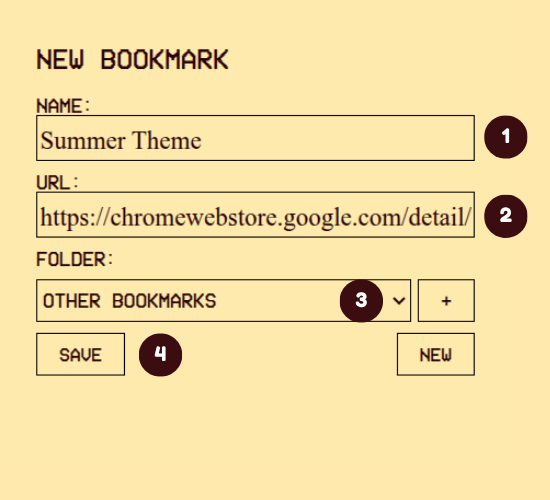
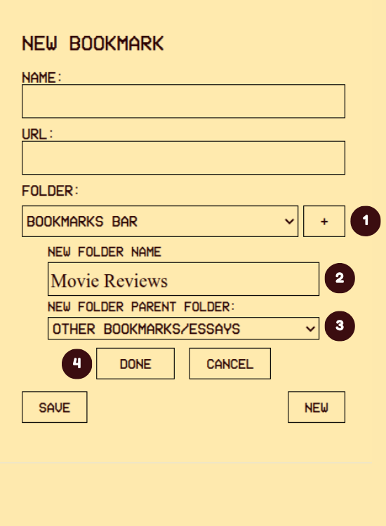

# BMSaver
BMSaver is an extension for Firefox-based browsers that allows you to save bookmarks without first landing on webpages. All you need is the link and a title. You can also use BMSaver to create new folders in your browser's bookmark tree.

## Installing It
BMSaver can be installed through the Firefox addons repository.
https://addons.mozilla.org/en-US/firefox/addon/bmsaver/

## Using It
BMSaver is designed to be just like filling out a real-life form.

### Saving Bookmarks
To save a bookmark:
1. Type in the bookmark's title
2. Type in or paste the bookmark's link
3. Choose the bookmark's parent folder from the folder dropdown menu
4. Click on **SAVE**

To create another bookmark, click on **NEW** and repeat steps 1-4

### Creating Folders
To create a folder:
1. Click on the + button beside the folder dropdown menu
2. Type in the folder's title
3. Choose the folder's parent folder from the **NEW FOLDER PARENT FOLDER** dropdown menu
4. Click on **DONE**

### Canceling Folders/Bookmarks
To cancel a new bookmark: Click on **NEW**. This will clear all fields.

To cancel a new folder: Click on **CANCEL**. This will clear the new folder fields and hide the new folder controls.

## The Tech
BMSaver is written in HTML, CSS, and JS. 

Some visual elements were designed with Figma.
